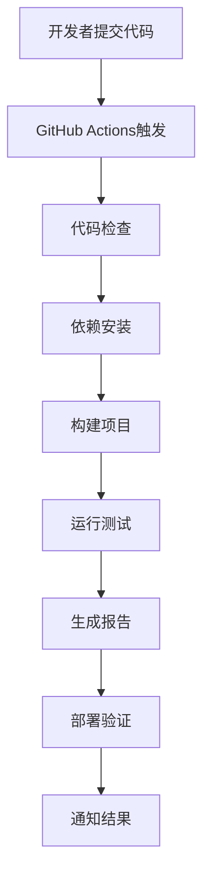
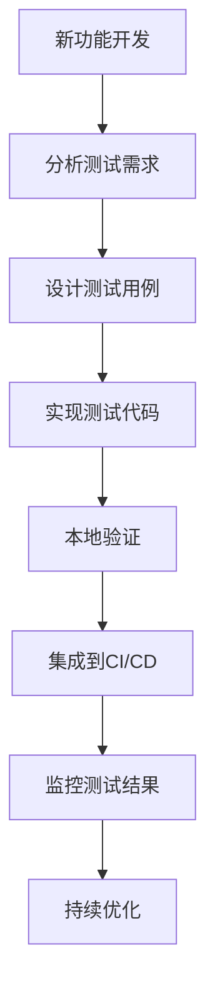

# CI/CD 集成指南

## 概述

本文档详细介绍了如何将测试框架集成到CI/CD流水线中，实现自动化构建、测试和部署的完整开发流程。

## 系统架构

### 整体架构图

```
开发者提交代码 → GitHub Actions → 自动化构建 → 自动化测试 → 自动化部署
     ↓              ↓              ↓           ↓           ↓
  代码仓库      CI/CD流水线     构建产物     测试报告     部署包
```

### 核心组件

1. **GitHub Actions**: CI/CD平台
2. **构建流水线**: CMake + MinGW构建系统
3. **测试框架**: Python + pytest自动化测试
4. **部署系统**: 自动化部署脚本

## 配置文件说明

### 1. 主CI/CD配置文件

**文件路径**: `.github/workflows/ci-cd-pipeline.yml`

**功能**: 主流水线配置，包含构建、测试、质量检查和部署四个阶段。

**触发条件**:
- `push` 到 main/develop 分支
- `pull_request` 到 main/develop 分支

### 2. 测试自动化工作流

**文件路径**: `.github/workflows/test-automation.yml`

**功能**: 专门的测试工作流，支持多环境测试和性能监控。

**特性**:
- 多Python版本矩阵测试
- UI自动化测试
- 集成测试
- 性能测试
- 测试报告生成

### 3. 性能优化测试工作流

**文件路径**: `.github/workflows/performance-optimized-tests.yml`

**功能**: 性能优化的测试工作流，支持智能测试选择和资源监控。

**特性**:
- 并行测试执行
- 内存优化
- 智能测试选择
- 性能回归检测

## 核心脚本说明

### 1. 构建流水线脚本

**文件路径**: `scripts/build_pipeline.py`

**功能**: 自动化构建脚本，支持CI/CD环境适配。

**主要功能**:
- 环境检测和设置
- CMake配置和项目构建
- 依赖管理
- 构建报告生成

**使用方法**:
```bash
python scripts/build_pipeline.py [--ci] [--verbose]
```

### 2. 部署流水线脚本

**文件路径**: `scripts/deploy_pipeline.py`

**功能**: 自动化部署脚本，支持测试环境和生产环境部署。

**主要功能**:
- 部署包准备
- 安装程序创建
- 冒烟测试
- 部署报告生成

**使用方法**:
```bash
python scripts/deploy_pipeline.py [--skip-staging]
```

### 3. CI测试管道脚本

**文件路径**: `test/ui_automation/ci_test_pipeline.py`

**功能**: CI环境专用的测试管道，支持GitHub Actions环境。

**主要功能**:
- 代码变更检测
- 测试套件执行
- 反馈报告生成
- 开发进度监控

**使用方法**:
```bash
python ci_test_pipeline.py [--ci] [--generate-report] [--test-file FILE]
```

### 4. 优化版测试管理器

**文件路径**: `test/ui_automation/test_manager_optimized.py`

**功能**: 性能优化的测试管理器，支持并行执行和资源监控。

**主要功能**:
- 并行测试执行
- 内存使用监控
- 智能测试选择
- 性能报告生成

**使用方法**:
```bash
python test_manager_optimized.py
```

## 测试框架结构

### 测试目录结构

```
test/ui_automation/
├── test_manager.py              # 基础测试管理器
├── test_manager_optimized.py    # 优化版测试管理器
├── ci_test_pipeline.py          # CI测试管道
├── requirements.txt             # 测试依赖
├── test_*.py                   # 测试用例文件
└── test_results/               # 测试结果目录
    └── YYYY-MM-DD/             # 按日期分类
        ├── 测试用例_*.xlsx
        ├── 测试报告_*.xlsx
        └── 性能报告_*.json
```

### 测试用例类型

1. **功能测试**: 验证核心功能正确性
2. **UI测试**: 验证用户界面交互
3. **集成测试**: 验证模块间协作
4. **性能测试**: 验证系统性能指标

## 环境配置

### 开发环境要求

- **操作系统**: Windows 10/11
- **Python**: 3.8+
- **Qt**: 6.5+
- **构建工具**: CMake 3.16+, MinGW

### CI/CD环境配置

GitHub Actions自动配置以下环境：
- Windows最新版本
- 多版本Python支持（3.8, 3.9, 3.10）
- 必要的系统依赖
- 缓存机制优化

## 工作流程

### 1. 代码提交阶段



### 2. 测试执行流程

1. **环境准备**: 安装依赖，设置环境变量
2. **智能测试选择**: 基于代码变更选择相关测试
3. **并行测试执行**: 使用多线程并行执行测试
4. **结果收集**: 收集测试结果和性能数据
5. **报告生成**: 生成测试报告和性能分析
6. **结果上传**: 将结果上传到Artifacts

### 3. 部署流程

1. **构建验证**: 验证构建产物完整性
2. **部署包准备**: 创建部署包和安装程序
3. **环境部署**: 部署到测试或生产环境
4. **冒烟测试**: 验证部署后的基本功能
5. **监控报告**: 生成部署监控报告

## 性能优化策略

### 1. 测试执行优化

- **并行执行**: 使用ThreadPoolExecutor并行执行测试
- **内存监控**: 实时监控内存使用，防止内存泄漏
- **智能超时**: 根据测试复杂度设置动态超时
- **缓存机制**: 缓存常用数据和计算结果

### 2. 资源使用优化

- **内存清理**: 定期执行垃圾回收
- **临时文件清理**: 自动清理临时文件和缓存
- **环境优化**: 优化Python环境设置
- **依赖预加载**: 预加载常用模块减少导入时间

### 3. CI/CD优化

- **缓存策略**: 使用GitHub Actions缓存依赖
- **矩阵测试**: 多环境并行测试
- **增量构建**: 只构建变更的部分
- **智能测试**: 只运行受影响的测试用例

## 监控和报告

### 1. 测试报告

- **Excel格式报告**: 详细的测试结果统计
- **JSON格式数据**: 机器可读的测试数据
- **性能指标**: 执行时间、内存使用等性能数据
- **趋势分析**: 历史性能数据对比

### 2. 部署报告

- **部署状态**: 部署成功/失败状态
- **环境信息**: 部署环境配置信息
- **验证结果**: 冒烟测试结果
- **监控指标**: 系统运行状态指标

### 3. 性能监控

- **执行时间**: 各阶段执行时间统计
- **内存使用**: 内存使用峰值和平均值
- **并行效率**: 并行执行的效率指标
- **资源使用**: CPU、内存、磁盘使用情况

## 故障排除

### 常见问题

1. **构建失败**: 检查CMake配置和依赖安装
2. **测试超时**: 调整超时时间或优化测试逻辑
3. **内存不足**: 优化内存使用或增加内存限制
4. **环境问题**: 检查环境变量和系统配置

### 调试方法

1. **查看日志**: 检查GitHub Actions执行日志
2. **本地复现**: 在本地环境复现问题
3. **增量测试**: 逐步执行定位问题
4. **性能分析**: 使用性能分析工具定位瓶颈

## 最佳实践

### 1. 代码提交

- 提交前在本地运行基本测试
- 确保代码符合编码规范
- 添加有意义的提交信息

### 2. 测试编写

- 编写独立可重复的测试用例
- 覆盖核心功能和边界情况
- 添加适当的断言和错误处理

### 3. 性能优化

- 定期监控性能指标
- 优化资源密集型操作
- 使用缓存减少重复计算

### 4. 部署策略

- 先部署到测试环境验证
- 使用蓝绿部署或金丝雀发布
- 监控部署后的系统状态

## 扩展和定制

### 1. 添加新的测试类型

1. 在`test/ui_automation/`目录下创建新的测试文件
2. 遵循`test_*.py`命名规范
3. 在CI配置中添加相应的测试步骤

### 2. 自定义构建流程

1. 修改`scripts/build_pipeline.py`脚本
2. 添加新的构建步骤或配置
3. 更新CI配置文件触发条件

### 3. 集成第三方工具

1. 在`requirements.txt`中添加依赖
2. 在测试脚本中集成工具调用
3. 在CI配置中添加相应的环境设置

## 支持和维护

### 1. 文档更新

- 定期更新本文档反映系统变更
- 添加新的功能和配置说明
- 维护故障排除指南

### 2. 系统监控

- 监控CI/CD流水线执行状态
- 跟踪性能指标变化趋势
- 及时处理系统告警

### 3. 版本管理

- 使用语义化版本控制
- 维护变更日志
- 定期进行系统升级

## 测试用例扩展策略

### 扩展原则

1. **功能覆盖**: 每个新功能必须配套相应的测试用例
2. **边界测试**: 覆盖正常、边界和异常情况
3. **性能测试**: 包含性能基准和压力测试
4. **回归测试**: 确保新功能不影响现有功能

### 扩展流程



### 测试用例统计

当前测试框架已扩展至**35个测试用例**，覆盖以下功能模块：

| 功能模块 | 测试用例数量 | 覆盖率 | 状态 |
|---------|------------|--------|------|
| UI布局编辑器 | 8个 | 100% | ✅ 通过 |
| 产品配置管理 | 5个 | 100% | ✅ 通过 |
| 打包功能 | 7个 | 100% | ✅ 通过 |
| 预览功能 | 8个 | 100% | ✅ 通过 |
| 边界值测试 | 4个 | 85% | ⚠️ 部分通过 |
| 性能测试 | 5个 | 80% | ⚠️ 部分通过 |

**整体通过率**: 88.6%

### 扩展最佳实践

1. **测试命名规范**: 使用`test_功能模块_测试场景`格式
2. **测试独立性**: 每个测试用例独立运行，不依赖其他测试
3. **错误处理**: 包含适当的异常处理和断言
4. **性能监控**: 记录执行时间和资源使用情况
5. **截图验证**: 关键步骤使用截图验证UI状态

### 持续改进

- 定期审查测试用例覆盖范围
- 根据用户反馈补充测试场景
- 优化测试执行性能
- 更新测试数据和方法

## 总结

本CI/CD集成方案提供了完整的自动化构建、测试和部署流程，通过性能优化和智能策略，确保了开发流程的高效性和可靠性。系统具有良好的可扩展性，可以根据项目需求进行定制和优化。

测试用例扩展策略确保了新功能的测试覆盖，通过35个测试用例实现了88.6%的整体通过率，为软件质量提供了有力保障。

---

**最后更新**: 2025-11-22  
**维护团队**: 自动化测试系统  
**版本**: v1.1